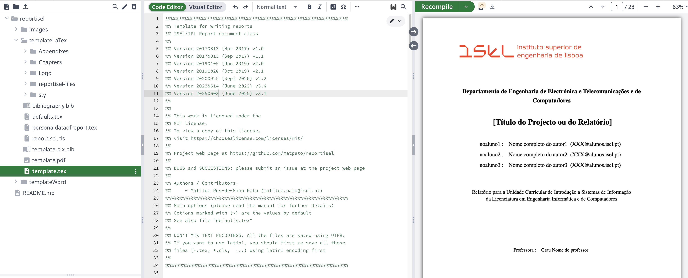

<p align="center">
    <!-- PROJECT LOGO -->
    <br />
    <div style="display: flex; align-items: center;">
        <div style="flex: 1;">
            <a href="https://isel.pt" target="_blank">
                
            </a>
        </div>
    </div>

[](https://github.com/matpato/reportisel)
[](https://github.com/matpato/reportisel)
[](https://github.com/matpato/reportisel)
[](https://github.com/matpato/reportisel)

[](https://github.com/matpato/reportisel/graphs/commit-activity)
[](https://www.latex-project.org/)
[](https://www.latex-project.org/lppl/lppl-1-3c)


](https://img.shields.io/github/last-commit/matpato/reportisel?color=blue)
[](https://opensource.org/licenses/MIT)
</p>

A comprehensive document template collection for bachelor's degree technical reports at ISEL (Instituto Superior de Engenharia de Lisboa). Available in both **LaTeX** and **Microsoft Word** formats.




## Overview

This template collection provides structured frameworks for technical reports in Computer Science Engineering and Telecommunications Engineering programs. Designed for students working on industry projects, research collaborations, and scholarship programs, it offers flexibility for different writing preferences and technical requirements.

**Template Options:**
- **LaTeX Version**: Professional typesetting with advanced mathematical notation, automated formatting, and publication-quality output
- **Microsoft Word Version**: User-friendly interface with familiar editing tools, ideal for collaborative editing and quick formatting

For advanced thesis preparation, see the companion project: [iselthesis](https://github.com/matpato/iselthesis.git).

## Template Selection Guide

### Choose LaTeX When:
- Working with complex mathematical formulations and equations
- Requiring precise control over document formatting and typography
- Collaborating on projects with version control systems (Git)
- Preparing documents for academic publication or professional presentation
- Need automated bibliography and cross-reference management

### Choose Microsoft Word When:
- Prefer familiar WYSIWYG editing environment  
- Working in teams that require real-time collaborative editing
- Need quick document setup with minimal learning curve
- Supervisor or industry partners require Word format for reviews
- Integration with other Microsoft Office tools is essential

---

# LaTeX Version

## Features

- **Bilingual Support**: Portuguese and English
- **Professional Layout**: Optimized for both screen viewing and print
- **Comprehensive Structure**: Includes chapters, appendices, bibliography, and nomenclature
- **Industry Standards**: Follows academic and professional formatting guidelines
- **Flexible Configuration**: Multiple document options and customization settings

## Quick Start

### Document Configuration

```latex
\documentclass[
    rpt,        % Document type: rpt (Technical Report) or preprpt (Preliminary Report)
    pt,         % Language: pt (Portuguese) or en (English)
    twoside,    % Layout: twoside or oneside
    12pt,       % Font size: 12pt, 11pt, or 10pt
    a4paper,    % Paper format
    utf8,       % Text encoding
    onscreen,   % Output: onscreen or onpaper
    hyperref = true,    % Enable hyperlinks
    listof = totoc     % Include lists in table of contents
]{reportisel}
```

### Compilation Instructions

#### Basic Document (no references/nomenclature)
```bash
pdflatex template
```

#### With Nomenclature
```bash
pdflatex template
makeindex template.nlo -s nomencl.ist -o template.nls
pdflatex template
pdflatex template
```

#### With Bibliography
```bash
pdflatex template
bibtex template
pdflatex template
pdflatex template
```

## Project Structure

```
reportisel/
├── Appendixes/          # Supplementary material sections
├── Logo/                # Institution logos and branding
├── Chapters/            # Main content directory
│   ├── chapter1.tex     # Individual chapter files
│   ├── chapter2.tex
│   ├── scripts/         # Utility scripts for cleanup
│   └── img/             # Images and figures
├── defaults.tex         # Institution and program defaults (CUSTOMIZE)
├── personaldataofthesis.tex  # Author and project information (CUSTOMIZE)
├── template.tex         # Main document file
├── bibliography.bib     # Reference database
├── reportisel.cls       # LaTeX class file (DO NOT MODIFY)
└── relationalAlgebra.sty  # Specialized symbols for IS courses
```

## Customization Guide

### Essential Files to Modify

1. **`defaults.tex`**: Update institution name, faculty logo, degree program
2. **`personaldataofthesis.tex`**: Add author details, project title, supervisor information
3. **`bibliography.bib`**: Import citations using [Google Scholar BibTeX export](http://scholar.google.pt/scholar_settings?hl=en&as_sdt=0,5)

### Important Notes

- The template automatically handles abstract placement based on the selected language
- Generated auxiliary files (`.aux`, `.log`, `.out`, `.bbl`) contain important compilation information
- Use the `output-directory` parameter to organize generated files if desired

## Development Environment Options

### Cloud-Based (Recommended for Beginners)

**Overleaf**: Professional online LaTeX editor with real-time collaboration
- Create account at [overleaf.com](https://www.overleaf.com)
- Upload this template as a zipped project
- Collaborative editing for team projects

### Desktop Applications

**TeXmaker**: Cross-platform integrated LaTeX environment
- Download: [texmaker.org](http://www.xm1math.net/texmaker/)
- Suitable for offline development

**MiKTeX**: Complete TeX/LaTeX distribution for Windows
- Download: [miktex.org](https://miktex.org)
- Comprehensive package management

## Learning Resources

### LaTeX Fundamentals
- [Official LaTeX Project](https://www.latex-project.org)
- [Overleaf 30-Minute Tutorial](https://www.overleaf.com/learn/latex/Learn_LaTeX_in_30_minutes)
- [Portuguese LaTeX Manual](http://www4.di.uminho.pt/~jcr/AULAS/didac/manuais/manual-latex.pdf)

### Advanced Graphics
- [TikZ and PGF Examples](http://www.texample.net/tikz/)

---

# Microsoft Word Version

The Word template provides the same professional structure and formatting guidelines as the LaTeX version, adapted for Microsoft Word's interface. It includes:

## Features
- **Pre-formatted Styles**: Heading styles, caption formats, and bibliography styles
- **Template Structure**: Cover page, abstract pages, chapter layouts, and appendix formats  
- **Collaboration Tools**: Comment system, track changes, and real-time co-authoring
- **Reference Management**: Compatible with Mendeley, Zotero, and EndNote
- **Cross-Platform**: Works with Word for Windows, Mac, and Word Online

## Getting Started with Word Template
1. Download the Word template file from the repository
2. Open in Microsoft Word (2016 or later recommended)
3. Customize the cover page and document properties
4. Use the provided styles for consistent formatting
5. Enable track changes for collaborative editing

## Word Template Structure
- **Cover Page**: Pre-formatted title page with ISEL branding
- **Abstract Templates**: Portuguese and English abstract layouts
- **Chapter Templates**: Structured section formatting with proper heading hierarchy
- **Figure and Table Captions**: Automated numbering and cross-reference support
- **Bibliography Section**: Citation style consistent with academic standards

---

# General Guidelines (Both Versions)

## Academic Context

This template supports various academic and professional activities:
- **Industry Collaboration Projects**: Professional formatting for corporate partnerships
- **Research Reports**: Structured presentation of experimental results
- **Scholarship Documentation**: Standardized format for funding applications
- **Technical Documentation**: Engineering project reports and specifications

## Contributing

We welcome contributions from faculty, students, and industry partners. Please ensure any modifications maintain compatibility with ISEL's academic standards.

**For LaTeX contributions**: Submit pull requests with proper documentation  
**For Word template improvements**: Include before/after screenshots and detailed change descriptions

## Version Compatibility

**LaTeX Requirements**: TeX Live 2020 or later, MiKTeX 21.1 or later  
**Word Requirements**: Microsoft Word 2016 or later, Word Online, or compatible alternatives (LibreOffice Writer with limitations)

## Acknowledgments

**Author**: Matilde Pós-de-Mina Pato  
**Last Updated**: June 03, 2025  
**Institution**: Instituto Superior de Engenharia de Lisboa (ISEL/IPL)

*Note: This template is an unofficial community resource and not formally endorsed by ISEL/IPL.*

## License

[MIT License](https://choosealicense.com/licenses/mit/) - Free for academic and commercial use.